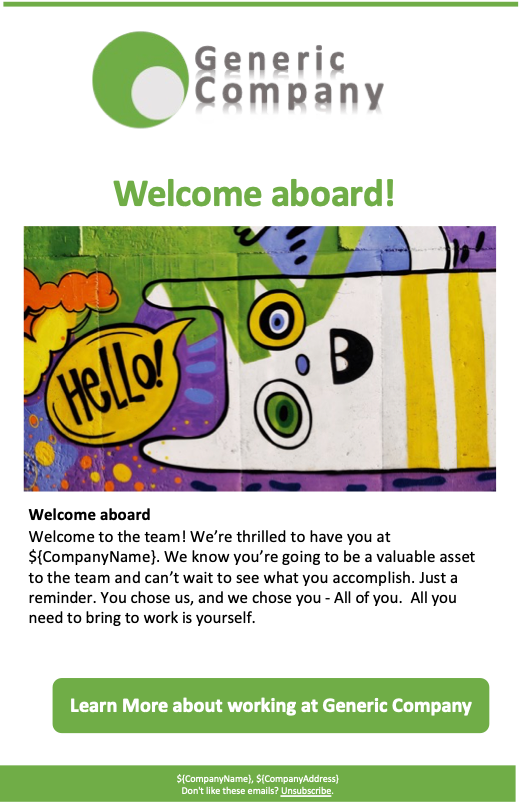
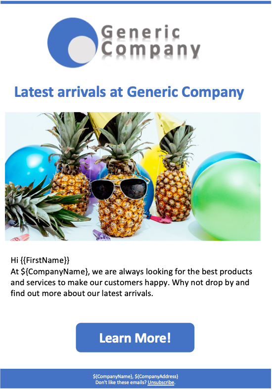

## Introduction
Amazon Pinpoint is a flexible, and scalable outbound and inbound marketing communications service. 

The "Email Templates for Amazon Pinpoint" solution guidance helps customers launch their campaigns and journeys faster by installing customized, ready-to-send,leveraging eye-catching templates for email communications.

Email Templates for Amazon Pinpoint cuts down the effort needed to create email templates from hours to a matter of minutes.  It helps customers launch their campaigns and journeys faster by leveraging professionally designed, mobile friendly templates for email communications out-of-the-box.  Furthermore, Email Templates for Amazon Pinpoint customizes the templates during the install process, with key parameters such as company details, logo, website and color scheme. While it is valuable, and usable out-of-the-box, the Email Templates are still fully customizable and editable to tailor for each business’ unique needs.

The "Email Templates for Amazon Pinpoint" solution guidance is designed to be responsive and look great on all popular device sizes and shapes from desktop to mobile.  The solution guidance includes templates to cover most customer and employee engagement needs: 
1)	Onboarding (Customer onboarding, Employee onboarding)
2) Sales announcements, Product launches, Promotions)
3)	Special Occasions (back to School, Seasonal)

Template Colors are customizable at install time (through Cloud Formation parameters)
A customer can install the same solution guidance multiple times to get different color schemes / branding.
Templates are “ready to go” – no placeholder text.  They can be sent as is (or customized)

## Support

The sample code; software libraries; command line tools; proofs of concept; templates; or other related technology (including any of the foregoing that are provided by our personnel) is provided to you as AWS Content under the AWS Customer Agreement, or the relevant written agreement between you and AWS (whichever applies). You should not use this AWS Content in your production accounts, or on production or other critical data. You are responsible for testing, securing, and optimizing the AWS Content, such as sample code, as appropriate for production grade use based on your specific quality control practices and standards. Deploying AWS Content may incur AWS charges for creating or using AWS chargeable resources, such as running Amazon EC2 instances or using Amazon S3 storage.

## Prerequisities

Access to Amazon pinpoint servcie is the only requirement.  As templates are stored at the service level in Pinpoint (as opposed to project level), there is no requirement to have a Pinpoint project created or started.  The email templates use the "stack name" to make the templates unique at installation time; so this stack can be installed multiple times in the same account as needed (for example to create multiple color versions of the templates, or separate branding)

## Architecture

1. The AWS Administrator installs the solution guidance CloudFormation template into a stack
2. The CloudFormation template prompts for parameters such as logo url, company name, address, color scheme etc.
3. The email templates installed are customized at installation time to include the parameters captured, in order to make them ready to use out-of-the-box
4. Templates are stored in Amazon pinpoint template repository.
5. An Amazon Pinpoint user can then use the email templates in any campaigns and journey they design.  Email templates are fully editable and customizable using the Amazon Pinpoint editor.
6. The Email templates installed are responsive, meaning they look professional on mobile or desktops.

## Templates Installed
Below is a sample of the templates installed followed by a list templates.
Each email template comes in 3 variation / Themes – The only difference between themes is the image.  These are the email templates installed.

<table>
  <tr>
    <td> </td>
    <td></td>
   <td></td>
   <td></td>
   </tr> 
 
</table>

| Template      | Usage         | Subject       | Call to Action |
| ------------- | ------------- | ------------- | -------------- |
| Email_Customer_Welcome  | New customer signup  | Welcome | CompanyURL |
| Email_Employee_Wecome  | New employee  | Welcome aboard | EmployeeURL |
| Email_Customer_Feedback | Regular cadence to get feedback on after purchase action | Help us make ${CompanyName] better | FeedbackURL |
| Email_Customer_Rating | Regular cadence to get feedback on after purchase action |  Invitation to review ${CompanyName} | RatingURL |
| Email_Customer_SalesPromotion | Regular cadence / Sales time | It’s Sale time at ${CompanyName} | PromotionURL |
| Email_Customer_LatestArrivals | Regular cadence / Sales time | Latest arrivals at ${CompanyName} | PromotionURL |
| Email_Customer_Occasion_BackToSchool | Calendar Event | It’s back to school time | PromotionURL |
| Email_Customer_Occasion_Winter | Calendar Event | It’s Winter time | PromotionURL |
| Email_Customer_Occasion_Summer | Calendar Event | It’s Summer time | PromotionURL |
| Email_Customer_Occasion_Spring | Calendar Event | It’s Spring time | PromotionURL |
| Email_Customer_Occasion_Autumn | Calendar Event | It’s Autumn time | PromotionURL |
| Email_Customer_Occasion_Fall   | Calendar Event | It’s Fall time   | PromotionURL |

## Deployment

<a href="/deployment/DEPLOYMENT.md">Deployment Guide</a>

